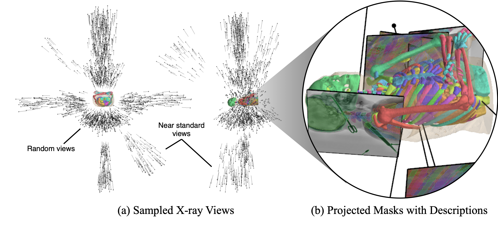

<h1 align="center">
FluoroSeg Dataset
  <br>
<a href="https://arxiv.org/abs/2403.08059"></a>
  <a href="https://github.com/arcadelab/fluorosam"></a>
  <a href="https://github.com/arcadelab/fluoroseg"></a>
  <a href="https://huggingface.co/datasets/benjamindkilleen/fluoroseg"></a>
  <br>
  <br>
  
  <br>
</h1>

FluoroSeg is a large-scale dataset of ~3M synthetic X-ray images, with mask and text pairs for organs and tools. The dataset is generated from a wide variety of human anatomies, imaging geometries, and viewing angles, and it is designed to support training of a language-promptable FM for X-ray image segmentation.  It was used to train the [FluoroSAM model](https://github.com/arcadelab/fluorosam), as described in the MICCAI 2025 paper, "[FluoroSAM: A Language-promptable Foundation Model for Flexible X-ray Image Segmentation](https://arxiv.org/abs/2403.08059)." 

This repository contains example code for loading the dataset, e.g. for training with PyTorch, and performing domain randomization/data augmentation to facilitate sim-to-real transfer.

## Generation Pipeline

<p align="center">
  
  <br>
</p>

FluoroSeg is a large-scale dataset of 3 million simulated X-ray images of the full body, for both diagnostic and interventional exams. [Building on](https://arxiv.org/abs/1803.08606) [prior](https://www.nature.com/articles/s42256-023-00629-1) [work](https://link.springer.com/chapter/10.1007/978-3-031-43996-4_13), the simulation environment takes as input a patient model derived from a real CT scan, along with associated segmentations and descriptions. Computer modeled surgical tools are positioned relative to the patient anatomy. Where FluoroSeg stands out in this space is in the scalability of image and ground truth simulation as well as the number of radiological exams which are replicated in a given environment. By combining volumetric and mesh-based rendering methods for CT, tool, and ground truth projection, the FluoroSeg simulation environment is able to generate numerous images with myriad ground truth segmentations and descriptions in an efficient, scalable manner. To replicate the variability of real-world X-ray imaging, the simulation environment samples from imaging geometries and viewing angles that are both random and near-standard, as determined automatically based on organ meshes.

| Split       | Head & Neck CTs | Head & Neck DRRs | Torso CTs | Torso DRRs | Lower Extremity CTs | Lower Extremity DRRs |   | Total CTs | Total DRRs |
|-------------|----------------|------------------|-----------|------------|----------------------|-----------------------|---|-----------|------------|
| Training    | 493            | 856,912          | 554       | 1,321,996  | 492                  | 636,306               |   | 1,539     | 2,814,214  |
| Validation  | 26             | 45,997           | 19        | 45,100     | 37                   | 47,946                |   | 82        | 139,043    |
| **Total**   | **519**        | **902,909**      | **573**   | **1,367,096** | **529**            | **684,252**           |   | **1,621** | **2,953,257** |

See [the paper](https://arxiv.org/abs/2403.08059) for more details.

## Installation

We recommend using [Conda](https://docs.conda.io/en/latest/) to manage your Python environment. For example, one could run:

```bash
git clone https://github.com/arcadelab/fluoroseg.git
cd fluoroseg
conda env create -f environment.yml
conda activate fluoroseg
pip install -e . # install as a locally editable package
```

## Citation

If you use FluoroSeg in your research, please consider citing our paper:

```bibtex
@inproceedings{killeen2025fluorosam,
  author       = {Killeen, Benjamin D. and Wang, Liam J. and Inigo, Blanca and Zhang, Han and Mehran, Armand and Taylor, Russell H. and Osgood, Greg and Unberath, Mathias},
  title        = {{FluoroSAM: A Language-promptable Foundation Model for Flexible X-ray Image Segmentation}},
  date         = {2025},
  booktitle    = {Proc. Medical Image Computing and Computer Assisted Intervention (MICCAI)},
  publisher    = {Springer},
}
```

## Acknowledgments

This work was supported by the Link Foundation Fellowship for Modeling, Training, and Simulation; the NIH under Grant No. R01EB036341, the NSF under Award No. 2239077, and Johns Hopkins University Internal Funds.

## Coming Soon

- HuggingFace dataset card
- HuggingFace model card for FluoroSAM